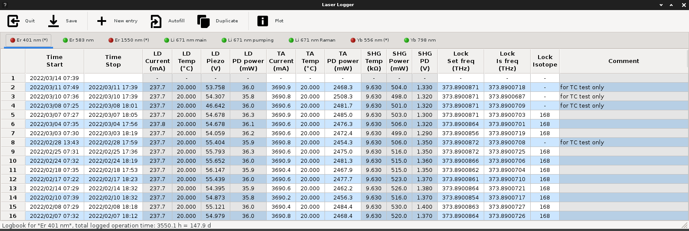
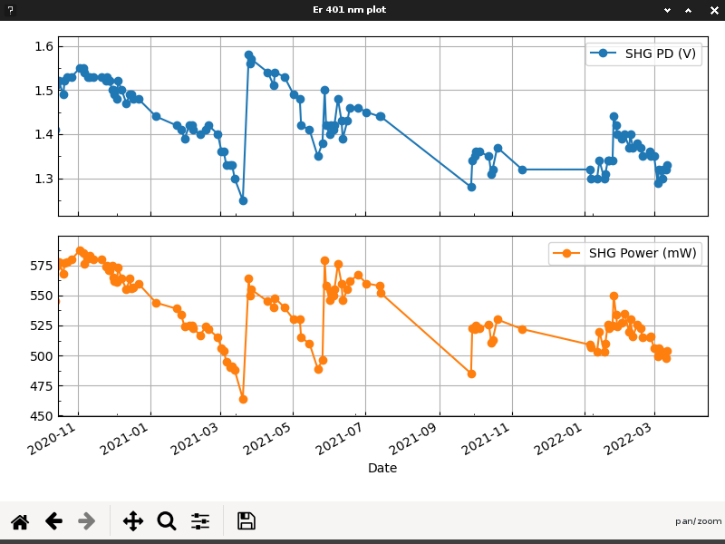

# LaserLogger

LaserLogger is a simple tool to log usage of your laser sources and their key
parameters such as currents, temperatures, power levels and frequencies.

This tool is particularly designed to work in conjunction with laser systems
by Toptica, from which the parameters can be obtained via an Ethernet
connection. Further data can be obtained from an MQTT broker or entered by
hand.

LaserLogger is built using Python and wxWidgets.

## Usage

A typical main window of LaserLogger might look as shown in the below
screenshot.



The application is organized into three areas: a toolbar at the top, the main
logbook area in the center and a statusbar at the bottom. We will now cover
each area in more detail

### The toolbar area

Most of the possible operations within LaserLogger can be selected either from
the toolbar or via a keyboard shortcut.

- Quit (Ctrl + p): Quit the program, a confirmation dialog is displayed in
  case of unsaved changes.

- Save (Ctrl + s): Save the state of the currently displayed logbook. The
  previous logbook file is maintained by creating a copy of the file first.

- New entry (Ctrl + n): Start a new logbook entry line and automatically fill
  in the start time with the current date and time.

- Autofill (Ctrl + a): Finish the topmost logbook entry line by filling in the
  stop time and all the parameters where information on automatic value
  retrieval is available. (See further [below](#logbook-csv-file-structure) for
  information on how to set this up.)

- Duplicate (Ctrl + d): Copy the value from the cell directly below the
  currently selected cell and paste it into the current cell.

- Plot (Ctrl + p): Plot one or more selected columns in total or only for the
  selected subset of entries as function of the start time.
  

### The logbook area

This main area of LaserLogger displays each configured logbook as its own tab.
Click a tab to display and activate the corresponding notebook. An asterisk
mark behind the logbook name indicates unsaved changes. The colored point is
green when the topmost line of the logbook has both start and stop times, that
is the laser is considered to be not in use. If, however, only a start time is
present then the laser is considered to be in current use and the dot turns
red.

The content of all cells can be manually entered and changed by the user. Most
cells will be of numeric type, though, so only numeric input is possible. Also
the display format is determined by the underlying display model.

To completely delete a row, left-click the number of the row on the very left
and select 'Delete row' from the popup menu.

### The statusbar

This is just your typical statusbar and mostly works as expected. It mostly
displays confirmational messages on the most recent activities, such as saving
a logbook. However, it also shows some general usage statistics (that is the
total operation time) for the currently displayed logbook when switching to
the corresponding notebook tab.

## Configuration

LaserLogger is configured via a JSON file `laserlogger_settings.json` that
needs to be put into the same folder as the main program. An example
configuration file that configures the individual logfiles and the MQTT
information might look as follows:

```
{
    "logbooks": [
        {
            "name": "Er 583 nm",
            "filename": "logfiles/logfile_583nm.csv"
        },
        {
            "name": "Er 401 nm",
            "filename": "logfiles/logfile_401nm.csv"
        },
        {
            "name": "Li 671 nm",
            "filename": "logfiles/logfile_671nm.csv"
        }
    ],
    "mqtt": {
            "broker": "192.168.1.11"
    }
}
```

This configuration specifies three 'logbooks', each with a name that will be
shown on the GUI and a filename for the CSV file itself. The number of
logbooks that can be specified is not limited (you might be running out of
screen space, though). The 'mqtt' section just defines the location of the
MQTT broker.

Note that LaserLogger will retain previous versions of the logbooks by
appending the numbers 1 to 9 to copies of the most recent versions of the
filename each time a new version is saved.

## Logbook CSV file structure

The loogbook files are standard comma-separated-value (CSV) files with the
first two rows as header information. The first row defines the column names
of the parameters included in the log. The second row includes information on
how this information can be collected automatically by LaserLogger and the
rest of the file is the logged data, one row per dataset. Even though the GUI
presents the most recent data first, in the CSV file the most recent data is
added to the end of the file.

A typical header might look as follows:

| Time\nStart | Time\nStop | LD\nCurrent\n(mA) | LD\nTemp\n(°C) | LD\nPiezo\n(V) | LD\nPD power\n(mW) | TA\nCurrent\n(mA) | TA\nTemp\n(°C) | TA\nPD power\n(mW) | SHG\nTemp\n(kΩ) | SHG\nPower\n(mW) | Lock\nEOM freq\n(MHz) | Lock\nIs freq\n(THz) | Lock\nULE trans\n(mV) | Lock\nIsotope | Comment |
| ------------- | ------------- | ------------- | ------------- | ------------- | ------------- | ------------- | ------------- | ------------- | ------------- | ------------- | ------------- | ------------- | ------------- | ------------- | ------------- |
|  |  | toptica://192.168.1.12:1998/laser1:dl:cc:current-act | toptica://192.168.1.12:1998/laser1:dl:tc:temp-act | toptica://192.168.1.12:1998/laser1:dl:pc:voltage-act  | toptica://192.168.1.12:1998/laser1:amp:pd:seed:power  | toptica://192.168.1.12:1998/laser1:amp:cc:current-act | toptica://192.168.1.12:1998/laser1:amp:tc:temp-act | toptica://192.168.1.12:1998/laser1:amp:pd:amp:power | mqtt://TEC/556NEL/resistance |  | mqtt://dpl_control/is/Yb_556_ULE_lock/frq | mqtt://wavemeter/WS8/is/is_ch5 | toptica://192.168.1.12:1998/io:fine-2:value-act |  |

In the first row the '\n' represent line breaks within the cell. The first line
of each cell marks a group. Every time the group changes LaserLogger will
switch between a gray and a white background for better visual distinction.

The first two column with start and stop time must always be present.
Additionally LaserLogger recognizes some key words to determine the column
format. Unit keywords are: THz, MHz, mA, A, mV, V, mW, nm. Furthermore
'Comment' (a strings) and 'Isotope' (an integer) are recognized. If not
recognized a single digit floating point value will be assumed.

The second header row determines how the specified information is retrieved.
An empty cell is for manual input. Entries beginning with 'toptica://' specify
that a Toptica laser system should be contacted at the given IP and port for
information under the specified path. See the Toptica documentation on
available paths. If the path contains 'value-act' LaserLogger will retrieve 10
values in 50 ms intervals and report the average value. This is useful to,
e.g., average over noisy photodiode readings. Similarly, the keywords
'mqtt://' signals that the information is to be obtained from the
corresponding MQTT topic to which LaserLogger is constantly subscribed, always
retaining the most recent message payload.

## Contact

For any comments and/or bug reports please report to the author, schaefer@scphys.kyoto-u.ac.jp.
